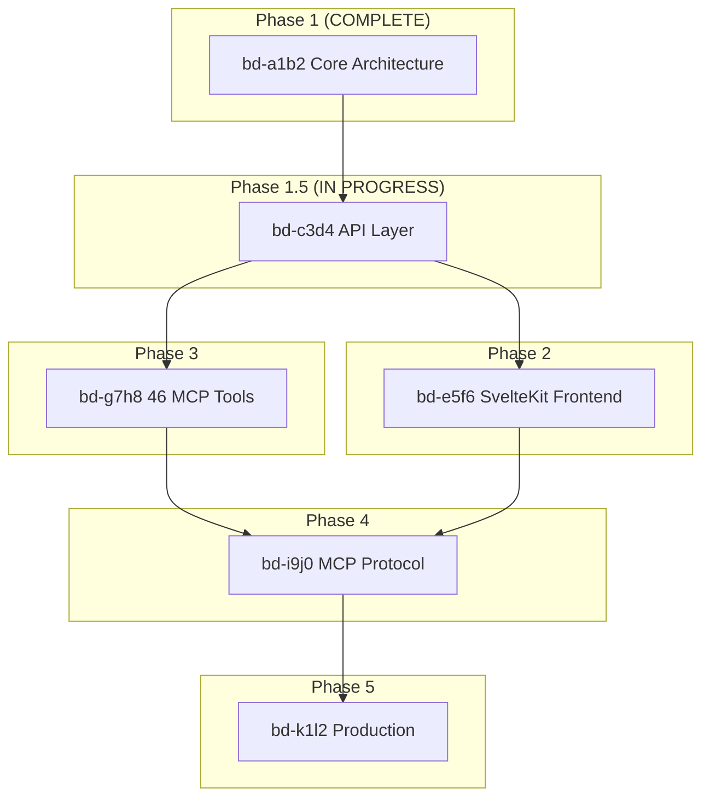

# MCP Agent Mail (Rust) - Comprehensive Project Plan

> Complete task breakdown for translating Python mcp_agent_mail to idiomatic Rust with SvelteKit frontend, using Depyler-assisted transpilation.

## Executive Summary

| Metric | Value |
|--------|-------|
| **Total MCP Tools** | 46 |
| **Implemented** | 8 (via REST API) |
| **Remaining** | 38 |
| **Phases** | 5 |
| **Strategy** | Depyler transpile → manual refinement → SvelteKit UI |

---

## Phase Overview

```
Phase 1   [████████████████████] 100% - Core Architecture (COMPLETE)
Phase 1.5 [████████████████░░░░]  80% - Accelerated Logic Porting (CURRENT)
Phase 2   [░░░░░░░░░░░░░░░░░░░░]   0% - SvelteKit Frontend
Phase 3   [░░░░░░░░░░░░░░░░░░░░]   0% - Full Feature Parity (46 Tools)
Phase 4   [░░░░░░░░░░░░░░░░░░░░]   0% - MCP Protocol & Search
Phase 5   [░░░░░░░░░░░░░░░░░░░░]   0% - Production Hardening
```

---

## Beads-Style Issue Tracker

### Epic: bd-a1b2 [COMPLETE] Phase 1 - Core Architecture

| ID | Type | Status | Title | Blockers |
|----|------|--------|-------|----------|
| bd-a1b2.1 | task | done | Initialize Rust workspace with Cargo.toml | - |
| bd-a1b2.2 | task | done | Create lib-core crate structure | bd-a1b2.1 |
| bd-a1b2.3 | task | done | Implement libsql database pool | bd-a1b2.2 |
| bd-a1b2.4 | task | done | Create schema migration (001_initial_schema.sql) | bd-a1b2.3 |
| bd-a1b2.5 | task | done | Implement git2 git_store module | bd-a1b2.2 |
| bd-a1b2.6 | task | done | Define domain models (Project, Agent, Message) | bd-a1b2.2 |
| bd-a1b2.7 | task | done | Implement BMC pattern for Project | bd-a1b2.6 |
| bd-a1b2.8 | task | done | Implement BMC pattern for Agent | bd-a1b2.6 |
| bd-a1b2.9 | task | done | Implement BMC pattern for Message | bd-a1b2.6 |
| bd-a1b2.10 | task | done | Create thiserror-based Error type | bd-a1b2.2 |

### Epic: bd-c3d4 [IN_PROGRESS] Phase 1.5 - API Layer

| ID | Type | Status | Title | Blockers |
|----|------|--------|-------|----------|
| bd-c3d4.1 | task | done | Set up Axum 0.6 server scaffold | bd-a1b2 |
| bd-c3d4.2 | task | done | Implement POST /api/project/ensure | bd-c3d4.1 |
| bd-c3d4.3 | task | done | Implement POST /api/agent/register | bd-c3d4.1 |
| bd-c3d4.4 | task | done | Implement POST /api/message/send | bd-c3d4.1 |
| bd-c3d4.5 | task | done | Implement POST /api/inbox | bd-c3d4.1 |
| bd-c3d4.6 | task | done | Implement GET /api/projects | bd-c3d4.1 |
| bd-c3d4.7 | task | done | Implement GET /api/projects/:slug/agents | bd-c3d4.1 |
| bd-c3d4.8 | task | done | Implement GET /api/messages/:id | bd-c3d4.1 |
| bd-c3d4.9 | task | done | Implement GET /api/health | bd-c3d4.1 |
| bd-c3d4.10 | task | todo | Add request validation with validator crate | bd-c3d4.1 |
| bd-c3d4.11 | task | todo | Add structured JSON error responses | bd-c3d4.1 |
| bd-c3d4.12 | task | todo | Write integration tests for all endpoints | bd-c3d4.2-9 |

### Epic: bd-e5f6 [TODO] Phase 2 - SvelteKit Frontend

| ID | Type | Status | Title | Blockers |
|----|------|--------|-------|----------|
| bd-e5f6.1 | task | todo | Initialize SvelteKit project in crates/services/web-ui | bd-c3d4 |
| bd-e5f6.2 | task | todo | Configure Bun as package manager | bd-e5f6.1 |
| bd-e5f6.3 | task | todo | Set up TailwindCSS with MD3 theme | bd-e5f6.1 |
| bd-e5f6.4 | task | todo | Configure adapter-static for Rust embedding | bd-e5f6.1 |
| bd-e5f6.5 | task | todo | Create API client service (fetch wrapper) | bd-e5f6.1 |
| bd-e5f6.6 | task | todo | Implement layout with navigation | bd-e5f6.3 |
| bd-e5f6.7 | task | todo | Create Projects list page | bd-e5f6.5, bd-e5f6.6 |
| bd-e5f6.8 | task | todo | Create Agents list page | bd-e5f6.5, bd-e5f6.6 |
| bd-e5f6.9 | task | todo | Create Inbox view page | bd-e5f6.5, bd-e5f6.6 |
| bd-e5f6.10 | task | todo | Create Message compose modal | bd-e5f6.5, bd-e5f6.6 |
| bd-e5f6.11 | task | todo | Create Message thread view | bd-e5f6.5, bd-e5f6.6 |
| bd-e5f6.12 | task | todo | Integrate static build into mcp-server | bd-e5f6.4 |
| bd-e5f6.13 | task | todo | Add CORS middleware for dev mode | bd-e5f6.12 |

### Epic: bd-g7h8 [TODO] Phase 3 - Full Feature Parity (46 Tools)

#### Cluster: SETUP (3 tools)

| ID | Type | Status | Title | Python Equivalent |
|----|------|--------|-------|-------------------|
| bd-g7h8.1 | task | done | health_check | `health_check` |
| bd-g7h8.2 | task | done | ensure_project | `ensure_project` |
| bd-g7h8.3 | task | todo | whois | `whois` |

#### Cluster: IDENTITY (3 tools)

| ID | Type | Status | Title | Python Equivalent |
|----|------|--------|-------|-------------------|
| bd-g7h8.4 | task | done | register_agent | `register_agent` |
| bd-g7h8.5 | task | todo | create_agent_identity | `create_agent_identity` |
| bd-g7h8.6 | task | done | list_contacts | `list_contacts` (via /agents) |

#### Cluster: MESSAGING (8 tools)

| ID | Type | Status | Title | Python Equivalent |
|----|------|--------|-------|-------------------|
| bd-g7h8.7 | task | done | send_message | `send_message` |
| bd-g7h8.8 | task | todo | reply_message | `reply_message` |
| bd-g7h8.9 | task | done | fetch_inbox | `fetch_inbox` |
| bd-g7h8.10 | task | todo | mark_message_read | `mark_message_read` |
| bd-g7h8.11 | task | todo | acknowledge_message | `acknowledge_message` |
| bd-g7h8.12 | task | todo | search_messages | `search_messages` |
| bd-g7h8.13 | task | todo | summarize_thread | `summarize_thread` |
| bd-g7h8.14 | task | todo | summarize_threads | `summarize_threads` |

#### Cluster: CONTACT (4 tools)

| ID | Type | Status | Title | Python Equivalent |
|----|------|--------|-------|-------------------|
| bd-g7h8.15 | task | todo | request_contact | `request_contact` |
| bd-g7h8.16 | task | todo | respond_contact | `respond_contact` |
| bd-g7h8.17 | task | todo | set_contact_policy | `set_contact_policy` |
| bd-g7h8.18 | task | todo | Implement AgentLink BMC | Supporting logic |

#### Cluster: FILE_RESERVATIONS (7 tools)

| ID | Type | Status | Title | Python Equivalent |
|----|------|--------|-------|-------------------|
| bd-g7h8.19 | task | todo | file_reservation_paths | `file_reservation_paths` |
| bd-g7h8.20 | task | todo | file_reservation_paths_status | `file_reservation_paths_status` |
| bd-g7h8.21 | task | todo | release_file_reservations | `release_file_reservations` |
| bd-g7h8.22 | task | todo | force_release_file_reservation | `force_release_file_reservation` |
| bd-g7h8.23 | task | todo | renew_file_reservations | `renew_file_reservations` |
| bd-g7h8.24 | task | todo | install_precommit_guard | `install_precommit_guard` |
| bd-g7h8.25 | task | todo | uninstall_precommit_guard | `uninstall_precommit_guard` |
| bd-g7h8.26 | task | todo | Implement FileReservation BMC | Supporting logic |
| bd-g7h8.27 | task | todo | Implement stale detection logic | Activity heuristics |
| bd-g7h8.28 | task | todo | Implement glob pattern matching | fnmatch semantics |

#### Cluster: BUILD_SLOTS (3 tools)

| ID | Type | Status | Title | Python Equivalent |
|----|------|--------|-------|-------------------|
| bd-g7h8.29 | task | todo | acquire_build_slot | `acquire_build_slot` |
| bd-g7h8.30 | task | todo | renew_build_slot | `renew_build_slot` |
| bd-g7h8.31 | task | todo | release_build_slot | `release_build_slot` |

#### Cluster: WORKFLOW_MACROS (4 tools)

| ID | Type | Status | Title | Python Equivalent |
|----|------|--------|-------|-------------------|
| bd-g7h8.32 | task | todo | macro_start_session | `macro_start_session` |
| bd-g7h8.33 | task | todo | macro_prepare_thread | `macro_prepare_thread` |
| bd-g7h8.34 | task | todo | macro_file_reservation_cycle | `macro_file_reservation_cycle` |
| bd-g7h8.35 | task | todo | macro_contact_handshake | `macro_contact_handshake` |

#### Cluster: PRODUCT_BUS (5 tools, conditional)

| ID | Type | Status | Title | Python Equivalent |
|----|------|--------|-------|-------------------|
| bd-g7h8.36 | task | todo | ensure_product | `ensure_product` |
| bd-g7h8.37 | task | todo | products_link | `products_link` |
| bd-g7h8.38 | task | todo | search_messages_product | `search_messages_product` |
| bd-g7h8.39 | task | todo | fetch_inbox_product | `fetch_inbox_product` |
| bd-g7h8.40 | task | todo | summarize_thread_product | `summarize_thread_product` |

### Epic: bd-i9j0 [TODO] Phase 4 - MCP Protocol Integration

| ID | Type | Status | Title | Blockers |
|----|------|--------|-------|----------|
| bd-i9j0.1 | task | todo | Add mcp-protocol-sdk dependency | bd-g7h8 |
| bd-i9j0.2 | task | todo | Define MCP tool schemas | bd-i9j0.1 |
| bd-i9j0.3 | task | todo | Implement MCP resource handlers | bd-i9j0.1 |
| bd-i9j0.4 | task | todo | Wire MCP tools to BMC logic | bd-i9j0.2, bd-g7h8 |
| bd-i9j0.5 | task | todo | Enable FTS5 search queries | bd-g7h8.12 |
| bd-i9j0.6 | task | todo | Implement MCP transport (stdio/http) | bd-i9j0.4 |
| bd-i9j0.7 | task | todo | Add MCP capability negotiation | bd-i9j0.6 |

### Epic: bd-k1l2 [TODO] Phase 5 - Production Hardening

| ID | Type | Status | Title | Blockers |
|----|------|--------|-------|----------|
| bd-k1l2.1 | task | todo | Add JWT/bearer token authentication | bd-i9j0 |
| bd-k1l2.2 | task | todo | Implement rate limiting | bd-k1l2.1 |
| bd-k1l2.3 | task | todo | Add structured logging (tracing) | - |
| bd-k1l2.4 | task | todo | Add OpenTelemetry metrics | bd-k1l2.3 |
| bd-k1l2.5 | task | todo | Write comprehensive unit tests | - |
| bd-k1l2.6 | task | todo | Write integration test suite | bd-k1l2.5 |
| bd-k1l2.7 | task | todo | Add input validation/sanitization | - |
| bd-k1l2.8 | task | todo | Implement graceful shutdown | - |
| bd-k1l2.9 | task | todo | Create Docker deployment config | bd-k1l2.8 |
| bd-k1l2.10 | task | todo | Write CLAUDE.md development protocol | - |
| bd-k1l2.11 | task | todo | Performance benchmarking | bd-k1l2.6 |

---

## Dependency Graph (Mermaid)



---

## Depyler Transpilation Strategy

### Files to Transpile (Priority Order)

| Python Module | Target Rust Module | Complexity | Notes |
|---------------|-------------------|------------|-------|
| `models.py` | lib-core/model/ | Low | Data classes → structs (DONE) |
| `file_reservations.py` | lib-core/model/file_reservation.rs | High | Complex TTL/stale logic |
| `agent_links.py` | lib-core/model/agent_link.rs | Medium | Contact policy logic |
| `search.py` | lib-core/search.rs | Medium | FTS5 query building |
| `tools/*.py` | mcp-server/tools/ | High | 46 tool implementations |

### Transpilation Workflow

```bash
# 1. Prepare Python file with type annotations
# 2. Run depyler transpile
depyler transpile temp_mcp_mail/src/file_reservations.py -o transpiled_reference/

# 3. Review pseudo-code output
# 4. Manually integrate into lib-core with Rust idioms
# 5. Write tests
# 6. Verify with CLI/API
```

---

## Immediate Next Actions (Ready Work)

These tasks have **no open blockers** and can be started now:

1. **bd-e5f6.1**: Initialize SvelteKit project
2. **bd-c3d4.10**: Add request validation
3. **bd-c3d4.11**: Add structured error responses
4. **bd-g7h8.26**: Implement FileReservation BMC (empty file exists)
5. **bd-k1l2.3**: Add structured logging

---

## Quality Gates

Before marking any epic as COMPLETE:

- [ ] All tasks in epic are done
- [ ] Zero clippy warnings
- [ ] All tests pass
- [ ] Code coverage > 70%
- [ ] No `unwrap()` in production code (only tests)
- [ ] Documentation updated
- [ ] SUMMARY.md reflects current state

---

## Session Protocol

At the end of each coding session:

1. Update this plan with completed tasks
2. File new issues for discovered bugs/TODOs
3. Run `cargo build && cargo clippy`
4. Commit with descriptive message
5. Update SUMMARY.md if phase status changed

---

## References

- [Python Source](https://github.com/Dicklesworthstone/mcp_agent_mail)
- [Depyler Transpiler](https://github.com/paiml/depyler)
- [MCP Protocol Spec](https://modelcontextprotocol.io)
- [Beads Issue Tracker](https://github.com/steveyegge/beads)
- [llms.txt Standard](https://llmstxt.org)
